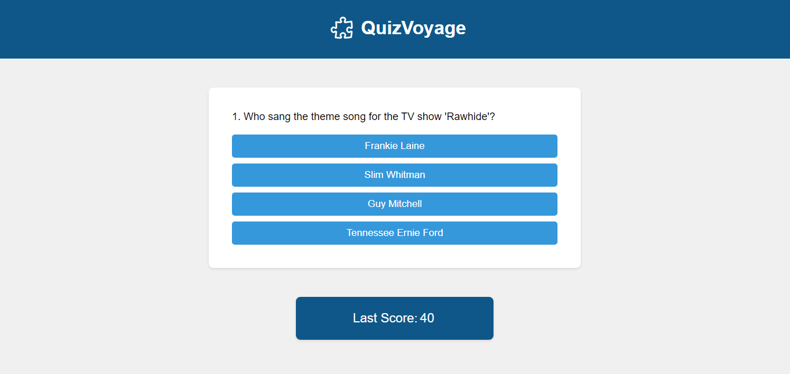

# QuizVoyage

QuizVoyage is an engaging quiz application that offers an exciting journey through diverse topics, challenging users to test their knowledge and enjoy a dynamic learning experience. QuizVoyage is created using HTML, CSS, and JavaScript.

## Features

- Every round you should answer 10 different questions.
- Each correct answer awards 10 points.
- Incorrect answers do not result in point deduction.
- Your scores are stored using local storage.
- Questions are randomized, providing a unique game experience each time.

## Access the Project

You can access the project [here](https://quiz-voyage.netlify.app/).

